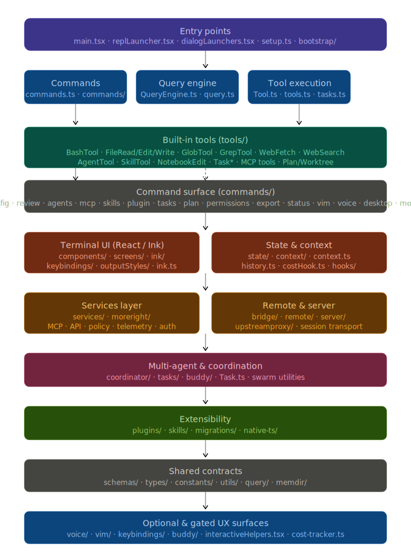

# Claude-code

`Claude-code` is a large TypeScript/Bun source snapshot for an interactive coding assistant that combines a terminal UI, command-driven workflows, tool execution, Model Context Protocol (MCP) integration, remote bridge/session plumbing, and multi-agent orchestration.

> This repository is useful as a recovery/reference codebase today, but it is not a complete, self-contained application checkout yet.

---

## Architecture



The codebase is organized into the following layers, from top to bottom:

| Layer | Modules | Purpose |
|---|---|---|
| **Entry points** | `main.tsx`, `replLauncher.tsx`, `dialogLaunchers.tsx`, `setup.ts`, `bootstrap/` | CLI wiring, session initialization, startup profiling |
| **Commands** | `commands.ts`, `commands/` | Feature-gated slash-command registry (100+ commands) |
| **Query engine** | `QueryEngine.ts`, `query.ts` | Prompt/response cycle management |
| **Tool execution** | `Tool.ts`, `tools.ts`, `tasks.ts` | Typed tool contracts, permissions, progress tracking |
| **Built-in tools** | `tools/` | BashTool, FileRead/Edit/Write, GlobTool, GrepTool, WebFetch, WebSearch, AgentTool, SkillTool, Task\*, MCP tools, Plan/Worktree |
| **Terminal UI** | `components/`, `screens/`, `ink/`, `outputStyles/` | React/Ink TUI components and interactive views |
| **State & context** | `state/`, `context/`, `hooks/`, `history.ts` | App state, providers, runtime context |
| **Services** | `services/`, `moreright/` | MCP, API clients, auth, telemetry, policy |
| **Remote & server** | `bridge/`, `remote/`, `server/`, `upstreamproxy/` | Session bridge, transport, upstream proxy |
| **Multi-agent** | `coordinator/`, `tasks/`, `buddy/`, `Task.ts` | Teammate workflows, swarm execution |
| **Extensibility** | `plugins/`, `skills/`, `migrations/`, `native-ts/` | Plugin and skill loading, version migrations |
| **Shared contracts** | `schemas/`, `types/`, `constants/`, `utils/`, `query/`, `memdir/` | Cross-cutting types and utilities |
| **Gated UX surfaces** | `voice/`, `vim/`, `keybindings/`, `interactiveHelpers.tsx` | Feature-flagged interaction modes |

---

## Current Status

As currently imported, this repository contains the application source tree itself rather than the full original project scaffold.

**What is present:**

- Core entrypoints: `main.tsx`, `commands.ts`, `Tool.ts`, `tools.ts`, `QueryEngine.ts`, `Task.ts`
- A large command surface under `commands/`
- A large tool surface under `tools/`
- UI, services, state, bridge, plugin, skill, and swarm-related modules
- Roughly 4,100 tracked files in total

**What is not present at the repo root:**

- `package.json`
- Lockfiles (`pnpm-lock.yaml`, `yarn.lock`, or `package-lock.json`)
- Top-level TypeScript/build config files
- CI/release metadata
- License metadata

**Practical implication:** this repo is good for code reading, indexing, search, selective extraction, and reconstruction work. It is not guaranteed to build or run out of the box until the missing project scaffolding is restored.

---

## What This Codebase Does

Based on the included source, this project implements an agentic coding assistant with:

- An interactive CLI/TUI application bootstrapped from `main.tsx`
- A large slash-command style command system registered in `commands.ts`
- A typed tool execution model centered around `Tool.ts` and `tools.ts`
- Built-in tools for shell execution, file operations, search, web access, notebooks, tasks, planning, MCP resources, and agent workflows
- Plugin and skill discovery/loading
- Remote session and bridge infrastructure
- Multi-agent and swarm/coordinator utilities
- React/Ink-based terminal UI components and dialogs
- Supporting systems for config, auth, telemetry, permissions, keybindings, onboarding, vim-like interaction, and voice-related features

Many capabilities are feature-gated. The source uses `bun:bundle` feature flags and environment checks, so the exact command and tool surface depends on the original build configuration.

---

## Repository Layout

One important detail: the imported code now lives at the repository root. In the original project, some imports were clearly relying on alias/path configuration such as `src/...`. That means the current layout is best understood as a recovered source root, not a finished standalone repo.

| Path | Purpose |
|---|---|
| `main.tsx` | Main startup path, bootstrap logic, CLI wiring, session initialization |
| `commands.ts` | Central command registry and feature-gated command loading |
| `Tool.ts` | Shared tool contracts, context, permissions, and tool-related types |
| `tools.ts` | Source of truth for built-in tool registration |
| `commands/` | 100+ command modules covering config, review, agents, MCP, skills, plugins, files, status, usage, export, and more |
| `tools/` | Built-in tools: bash, file read/edit/write, grep/glob, web fetch/search, plan/worktree, MCP, tasks, and agent/team operations |
| `components/` and `screens/` | React/Ink UI components and interactive views |
| `state/` and `context/` | App state, providers, and cross-cutting runtime context |
| `services/` | Higher-level service integrations including MCP, APIs, policy, tips, and background infrastructure |
| `bridge/`, `remote/`, and `server/` | Remote control, session bridge, transport, and server-side plumbing |
| `plugins/` and `skills/` | Extensibility systems for plugin and skill loading |
| `coordinator/`, `tasks/`, and `utils/swarm/` | Multi-agent coordination, teammate workflows, and swarm execution helpers |
| `migrations/` | Configuration and behavior migrations across versions |
| `schemas/`, `types/`, and `constants/` | Shared contracts and configuration types |
| `voice/`, `buddy/`, `vim/`, `keybindings/` | Optional UX surfaces and interaction modes |

---

## Notable Capabilities

**Command surface:**

- `help`, `config`, `login`, `logout`, `status`, `usage`, `export`
- `review`, `security-review`, `diff`, `files`, `branch`, `commit-push-pr`
- `agents`, `tasks`, `plan`, `permissions`, `skills`, `plugin`, `reload-plugins`
- `mcp`, `teleport`, `remote-env`, `desktop`, `mobile`, `ide`
- `theme`, `vim`, `keybindings`, `voice`, `summary`, `release-notes`

**Built-in tools:**

- `BashTool`
- `FileReadTool`, `FileEditTool`, `FileWriteTool`
- `GlobTool`, `GrepTool`
- `WebFetchTool`, `WebSearchTool`
- `NotebookEditTool`
- `AgentTool`, `SkillTool`
- `TaskCreateTool`, `TaskGetTool`, `TaskUpdateTool`, `TaskListTool`
- `ListMcpResourcesTool`, `ReadMcpResourceTool`, `ToolSearchTool`
- Planning/worktree tools and additional gated tools enabled by build flags

---

## Important Entry Points

If you are trying to understand or reconstruct the project, start here:

1. **`main.tsx`** — Main bootstrap path. Wires startup profiling, config loading, auth/session setup, CLI parsing, telemetry initialization, feature gating, and REPL/session launch behavior.
2. **`commands.ts`** — Central registry for builtin commands. The best high-level view of the command surface and which features are conditionally enabled.
3. **`Tool.ts`** — Defines the core tool execution contracts, permission context, progress types, and runtime interfaces shared across tool implementations.
4. **`tools.ts`** — Registers the builtin tools and shows which tools are always present versus feature-gated or environment-specific.
5. **`components/App.tsx`** — Top-level wrapper for interactive sessions, wiring the app state, stats, and FPS-related providers used by the terminal UI.

---

## Working With This Repository

The safest way to treat this repo is as a source archive that you can explore and incrementally restore.

**Recommended workflows:**

- Use it for code search, reference, and architectural recovery
- Extract specific subsystems into other projects if needed
- Reconstruct missing root metadata before attempting a full local build

**Useful exploration commands:**

```bash
rg "feature\(" .
rg "import .* from 'src/" .
rg "Tool" tools/ tools.ts
rg "commands/" commands.ts
```

---

## What Is Missing To Make It Runnable

To turn this repository into a normal buildable project, restore or recreate:

1. The package manifest and lockfile (`package.json`, `pnpm-lock.yaml`)
2. The original TypeScript path alias configuration (`tsconfig.json`)
3. Bun/Node build scripts
4. Linting, formatting, and test configuration
5. CI workflows and release metadata
6. Any generated assets or build-time codegen inputs not included in this snapshot

The code strongly suggests a Bun-based build with a TypeScript/React/Ink stack, but without the original root manifests the exact install or run commands cannot be stated confidently.

---

## Caveats

- Some imports still assume the original project layout and alias setup.
- Some features are only enabled when specific build flags or environment variables are present.
- Because the repo is source-only, setup instructions from the original project are not yet recoverable from this checkout alone.
- Before sharing or operationalizing the code more broadly, review secrets, endpoints, credentials, and licensing posture carefully.

---

## Suggested Next Steps

1. Add missing root project metadata (`package.json`, lockfile, `tsconfig.json`, formatter/linter config)
2. Decide whether to keep the source at repo root or move it back under a conventional `src/` layout
3. Document the command surface and tool model in dedicated docs
4. Add a license and contribution policy
5. Add tests and CI once the build is reproducible

Until then, this README should be read as documentation for a recovered source tree rather than a finished distributable repository.
